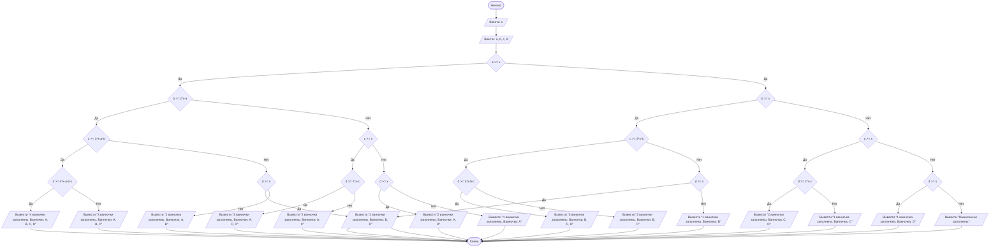

## Отчет по лабораторной работе № 1

#### № группы: ПМ-2401

#### Выполнил: Ядыкин Максим Михайлович

#### Вариант: 31

### Cодержание:

- [Постановка задачи](#1-постановка-задачи)
- [Входные и выходные данные](#2-входные-и-выходные-данные)
- [Выбор структуры данных](#3-выбор-структуры-данных)
- [Алгоритм](#4-алгоритм)
- [Программа](#5-программа)
- [Анализ правильности решения](#6-анализ-правильности-решения)

### 1. Постановка задачи

Пользователь задает одним натуральным числом объем четырех ваннночек. Потом для каждой задает объем воды, который будет налит.
Из-за того, что ванночки стоят лесенкой лишняя вода будет стекать в нижнюю ванночку. Нужно узнать сколько и какие ванночки заполнены.

### 2. Входные и выходные данные

#### Данные на вход

На вход программа должна получать 5 натуральных чисел.

|             | Тип         | min значение |
|-------------|-------------|--------------|
| X (Число 1) | Целое число |       1      |
| A (Число 2) | Целое число |       1      |
| B (Число 3) | Целое число |       1      |
| C (Число 4) | Целое число |       1      |
| D (Число 5) | Целое число |       1      |

#### Данные на выход

Программа должна ответить на вопрос сколько и какие ванночки заполнены, значит нужно вывести текст строкой через `println`.

### 3. Выбор структуры данных

Программа получает 5 натуральных числа, больше 0. Поэтому для их хранения
нужно выделить 5 переменных (`x`, `a`, `b`, `c`, `d`) типа `int`.

|             | название переменной | Тип (в Java) | 
|-------------|---------------------|--------------|
| X (Число 1) | `x`                 | `int`        |
| A (Число 2) | `a`                 | `int`        | 
| B (Число 3) | `b`                 | `int`        | 
| C (Число 4) | `c`                 | `int`        | 
| D (Число 5) | `d`                 | `int`        | 

Для вывода результата отдельная переменная не нужна.

### 4. Алгоритм

#### Алгоритм выполнения программы:

1. **Ввод данных:**  
   Программа считывает снчала одно, а потом четыре целых числа, обозначенные как `x` и `a`, `b`, `c`, `d` соответственно.

2. **Сравнение чисел:**  
   Программа сравнивает значения `a` и `x`. Если `a` больше или равно `x`, программа переходит к следующему шагу для
   работы с `b` и лишней водой. Если `x` больше, программа выполняет действия для работы с `b`.
   
4. **Вывод результата:**  
   На экран выводится количество заполненных ванночек и их названия.

#### Блок-схема


### 5. Программа

```java
import java.io.PrintStream;
import java.util.Scanner;
public class Main {
    public static Scanner in = new Scanner(System.in);
    public static PrintStream out = System.out;
    public static void main(String[] args) {
        out.print("Введите объем ванночки (только натуральное число): "); // Просит пользователя ввести объем ванночек
        int x = in.nextInt(); // Пользователь вводит в объем ванночек в переменную 'x'
        out.print("Введите объем воды, который наливается в первую, вторую," +
                " третью и четвртую ванночки соответственно (только натуральные числа): "); // Просит пользователя ввести объем воды, которую будут наливать в ванночки
        int a = in.nextInt(), b = in.nextInt(), c = in.nextInt(), d = in.nextInt(); // Пользователь вводит объем воды в переменные 'A', 'B', 'C', 'D'
        if (a>=x) { // Проверяем заполнится или переполнится первая (вверхняя) ванночка. На мне важно если ванночка заполнится, потому что в остатке получится 0
            if (b>=2*x-a) { // Проверяем заполнится или переполнится вторая ванночка с остатком воды, которая вылилась из первой. Выражение 2*x-a=x-(a-x) дает оставшийся объем ванночки
                if (c>=3*x-a-b) { // Проверяем заполнится или переполнится третья ванночка с остатком воды, которая вылилась из второй. Остаток считали так же, как в предыдущей строчки
                    if (d>=4*x-a-b-c) { // Проверяем заполнится или переполнится четвертая ванночка с остатком воды, которая вылилась из третьей.
                        out.println("4 ванночки заполнены.\nВанночки: A, B, C, D"); // Выводит результат
                    }
                    else {
                        out.println("3 ванночки заполнены.\nВанночки: A, B, C"); // Выводит результат
                    }
                }
                else {
                    if (d>=x) { // Проверяет переполнилась или заполнилась ли четвертая ванночка, когда прошлая не заполнилась или не переполнилась
                        out.println("3 ванночки заполнены.\nВанночки: A, B, D"); // Выводит результат
                    }
                    else {
                        out.println("2 ванночки заполнены.\nВанночки: A, B"); // Выводит результат
                    }
                }
            }
            else {
                if (c>=x) { // Проверяем переполнилась или заполнилась ли третья ванночка
                    if (d>=2*x-c) { // Проверяем переполнится или заполнится четвертая ванночка с остатком воды, которая вылилась из третьей
                        out.println("3 ванночки заполнены.\nВанночки: A, C, D"); // Выводит результат
                    }
                    else {
                        out.println("2 ванночки заполнены.\nВанночки: A, C"); // Выводит результат
                    }
                }
                else {
                    if (d>=x) { // Проверяем переполнилась или  заполнилась ли четвертая ванночка
                        out.println("2 ванночки заполнены.\nВанночки: A, D"); // Выводит результат
                    }
                    else {
                        out.println("1 ванночка заполнена.\nВанночки: A"); // Выводит результат
                    }
                }
            }
        }
        else {
            if (b>=x) { // Проверяем переполнилась или заполнилась вторая ванночка
                if (c>=2*x-b) { // Проверяем заполнится или переполнится третья ванночка с остатком воды, которая вылилась из второй
                    if (d>=3*x-b-c) {
                        out.println("3 ванночки заполнены.\nВанночки: B, C, D"); // Выводит результат
                    }
                    else {
                        out.println("2 ванночки заполнены.\nВанночки: B, C"); // Выводит результат
                    }
                }
                else {
                    if (d>=x) { // Проверяем переполнилась или  заполнилась ли четвертая ванночка
                        out.println("2 ванночки заполнены.\nВанночки: B, D"); // Выводит результат
                    }
                    else {
                        out.println("1 ванночка заполнена.\nВанночки: B"); // Выводит результат
                    }
                }
            }
            else {
                if (c>=x) { // Проверяем переполнилась или  заполнилась ли третья ванночка
                    if (d>=2*x-c) { // Проверяем заполнится или переполнится четвертая ванночка с остатком воды, которая вылилась из третьей.
                        out.println("2 ванночки заполнены.\nВанночки: C, D"); // Выводит результат
                    }
                    else {
                        out.println("1 ванночка заполнена.\nВанночки: C"); // Выводит результат
                    }
                }
                else {
                    if (d>=x) { // Проверяем переполнилась или  заполнилась ли четвертая ванночка
                        out.println("1 ванночка заполнена.\nВанночки: D"); // Выводит результат
                    }
                    else {
                        out.println("Ванночки не заполнены"); // Выводит результат
                    }
                }
            }
        }
    }
}
```
### 6. Анализ правильности решения

Программа работает корректно на множестве натуральных чисел.

1. Тест на заполнение всех ванночек, когда ни одна не переливается:

    - **Input**:
        ```
        2 2 2 2 2
        ```

    - **Output**:
        ```
        4 ванночки заполнены.
        Ванночки: A, B, C, D
        ```
2. Тест на заполнение всех ванночек, когда A переливается:

    - **Input**:
        ```
        2 5 1 1 1
        ```

    - **Output**:
        ```
        4 ванночки заполнены.
        Ванночки: A, B, C, D
        ```
3. Тест, когда ни одна ванночка не заполнена :

    - **Input**:
        ```
        2 1 1 1 1
        ```

    - **Output**:
        ```
        Ванночки не заполнены
        ```

4. Тест, когда какая-нибудь одна ванночка не заполнена :

    - **Input**:
        ```
        2 3 1 1 5
        ```

    - **Output**:
        ```
        3 ванночки заполнены.
        Ванночки: A, B, D
        ```
        
5. Тест, когда когда заполнена ванночка A :

    - **Input**:
        ```
        2 2 1 1 1
        ```

    - **Output**:
        ```
        1 ванночка заполнена.
        Ванночки: A
        ```
        
6. Тест, когда когда заполнена ванночка B :

    - **Input**:
        ```
        2 1 2 1 1
        ```

    - **Output**:
        ```
        1 ванночка заполнена.
        Ванночки: B
        ```

7. Тест, когда когда заполнена ванночка C :

    - **Input**:
        ```
        2 1 1 2 1
        ```

    - **Output**:
        ```
        1 ванночка заполнена.
        Ванночки: C
        ```

8. Тест, когда когда заполнена ванночка D:

    - **Input**:
        ```
        2 1 1 1 2
        ```

    - **Output**:
        ```
        1 ванночка заполнена.
        Ванночки: D
        ```

9. Тест, когда когда заполнены ванночки A, B :

    - **Input**:
        ```
        2 2 2 1 1
        ```

    - **Output**:
        ```
        2 ванночки заполнены.
        Ванночки: A, B
        ```

10. Тест, когда когда заполнены ванночки A, C :

    - **Input**:
        ```
        2 2 1 2 1
        ```

    - **Output**:
        ```
        2 ванночки заполнены.
        Ванночки: A, C
        ```

11. Тест, когда когда заполнены ванночки A, D :

    - **Input**:
        ```
        2 2 1 1 2
        ```

    - **Output**:
        ```
        2 ванночки заполнены.
        Ванночки: A, D
        ```

12. Тест, когда когда заполнены ванночки B, C :

    - **Input**:
        ```
        2 1 2 2 1
        ```

    - **Output**:
        ```
        2 ванночки заполнены.
        Ванночки: B, C
        ```

13. Тест, когда когда заполнены ванночки B, D :

    - **Input**:
        ```
        2 1 2 1 2
        ```

    - **Output**:
        ```
        2 ванночки заполнены.
        Ванночки: B, D
        ```

14. Тест, когда когда заполнены ванночки C, D :

    - **Input**:
        ```
        2 1 1 2 2
        ```

    - **Output**:
        ```
        2 ванночки заполнены.
        Ванночки: C, D
        ```

15. Тест, когда когда заполнены ванночки A, B, C :

    - **Input**:
        ```
        2 2 2 2 1
        ```

    - **Output**:
        ```
        3 ванночки заполнены.
        Ванночки: A, B, C
        ```

16. Тест, когда когда заполнены ванночки A, B, D :

    - **Input**:
        ```
        2 2 2 1 2
        ```

    - **Output**:
        ```
        3 ванночки заполнены.
        Ванночки: A, B, D
        ```

17. Тест, когда когда заполнены ванночки A, C, D :

    - **Input**:
        ```
        2 2 1 2 2
        ```

    - **Output**:
        ```
        3 ванночки заполнены.
        Ванночки: A, C, D
        ```

18. Тест, когда когда заполнены ванночки B, C, D :

    - **Input**:
        ```
        2 1 2 2 2
        ```

    - **Output**:
        ```
        3 ванночки заполнены.
        Ванночки: B, C, D
        ```
                                                                                       
